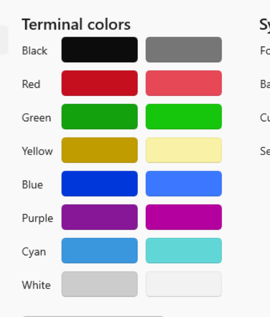
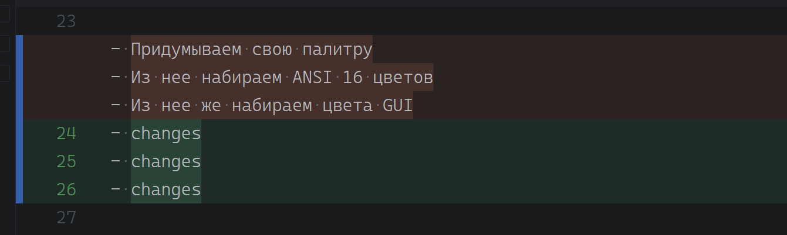
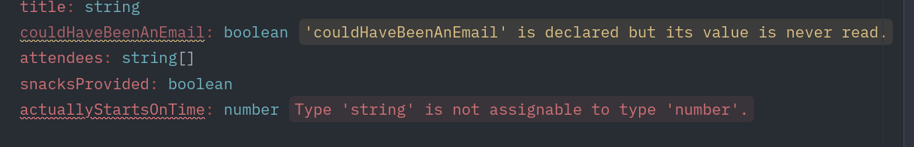
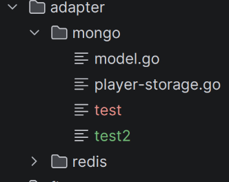
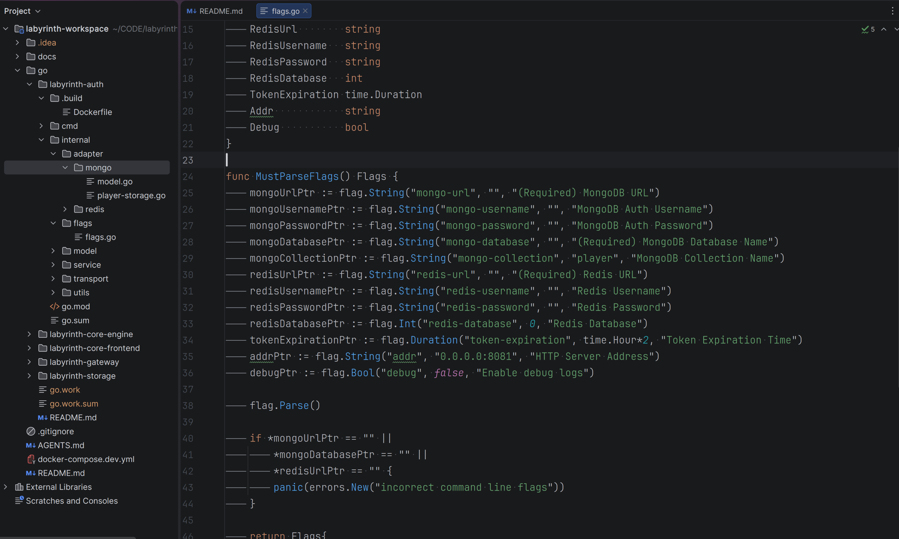
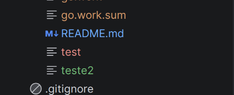

# Стандартная цветовая палитра

### Цвета фона:

- `Основной фон` - Фон в редакторе текста / терминале / стандартный фон сайта / gui
- `Дополнительный фон` - Дополнительный фон (например для карточек/поп-ап/хэдер/футер)
- `Дополнительный фон 2` - Запасной вариант доп фона в случае когда одного может не хватать
- `Глубокий дополнительны фон` - Дополнительный фон но более темный чем основной (Фон для фона)
- `Фон активного выделения` - Фон для активного выделенного текста
- `Фон неактивного выделения` - Фон для неактивного выделенного текста
- `Фон в позитивных сообщениях` - Доп фон для сообщений об успехе (общепринято как зеленый) (Мб нужен основной + доп)
- `Фон в предупреждениях` - Доп фон для предупреждений (общепринято как желтый) (Мб нужен основной + доп)
- `Фон для ошибок` - Доп фон (общепринято как красный)

### Цвета текста:

- `Основной текст` - Стандартный текст в редакторе / терминале / тексте / проводнике и т.д.
- `Дополнительный текст` - Дополнительный текст, который более темный чем основной (комментарии в коде например, или подписи вспомогательные) (например если белый текст, то доп текст серый)
- `Текст в позитивных сообщениях` - Доп текст для сообщений об успехе (общепринято как зеленый)
- `Текст в предупреждениях` - Доп текст для предупреждений (общепринято как желтый)
- `Текст для ошибок` - Доп текст (общепринято как красный)

### Акцентные цвета: (На основе ANSI палитны терминалов) (с ними предлагаю определиться позже)

- `black` - черный
- `red` - красный
- `green` - зеленый
- `yellow` - желтый
- `blue` - синий
- `purple` - пурпурный
- `cyan` - голубой
- `white` - белый
- `brblack` - яркий черный
- `brred` - яркий красный
- `brgreen` - яркий зеленый
- `bryellow` - яркий желтый
- `brblue` - яркий синий
- `brpurple` - яркий пурпурный
- `brcyan` - яркий голубой
- `brwhite` - яркий белый

---

# Визуальные ориентиры (для вдохновения)

- Палитра акцентных цветов в виндовом терминале

- Фоны для изменений в гите по дефолту красный и зеленый: удаление и добавление соответственно (конкретно тут еще и два цвета для каждого типа: основной и акцентный)

- В ide есть всплывашки для ошибок и ворнингов (красная и желтая соответственно). Фон + Цвет

- Один файл добавлен в гит, другой нет. Красный и зеленый соответственно

- На скрине несколько фонов: основной, доп (разделение между экранами светлее), активная строка, активное выделение (вкладка), неактивное выделение (проводник)

- Еще цвета текстов при работе с гитом. Мозг ломается

